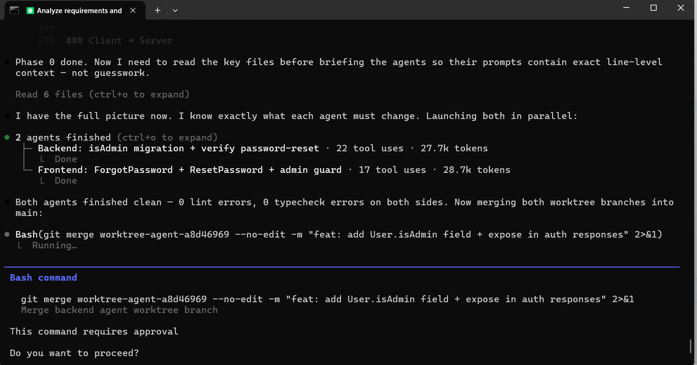

DA hackton

##  docker compose up --build
## Claude cli, Sonnet 4.6

### Part 1
#### 1. Generated md-agent files for Backend and FrontEnd using web claude based on app requirements.
 - I should have better review agent files, I missed some features from original spec.
 - I should have mentioned that I'am windows user and use Rancher desktop for Docker. 
 - First, it was a waste of time to re-write md files for windows and Ranche, it was failling to run Rancher from claude cli. 
#### 2. Switched prompt to use local DB no Docker. Decided to add docker functionality later.
#### 3. During execution of FE and BE commands asked to mark done tasks, but claude didn't do it
#### 4. After initla agent run FE and BE stared wiht registration;
#### 5 After some portion of cli intereation rooms and messaged were fixed, reached limit, waiting to refresh

### Part 2
When I got somehow working app, I added APP_Requirements.md file and run code base check to see what was done.
The next changes I tried to make using an agent orchestrator approach. That makes tokens fly away event faster :(

